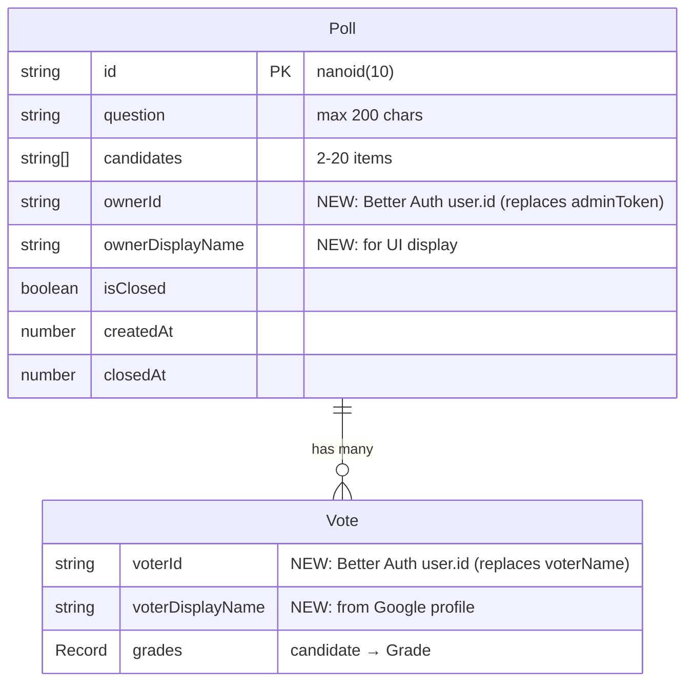

# feat: Auth, Sharing & Mobile Grade UX

## Enhancement Summary

**Deepened on:** 2026-02-21
**Sections enhanced:** All phases + architecture + data model
**Research agents used:** security-sentinel, architecture-strategist, kieran-typescript-reviewer, julik-frontend-races-reviewer, code-simplicity-reviewer, pattern-recognition-specialist, best-practices-researcher (×2), vercel-react-best-practices, learnings-researcher

### Key Improvements

1. **Security hardening** — `ENABLE_TEST_AUTH` double-guarded with `NODE_ENV`, session TTL reduced to 24h, `callbackUrl` same-origin validation, field naming fixed (Better Auth internal ID ≠ Google ID)
2. **Architecture simplification** — Removed `proxy.ts` entirely (Server Component validation sufficient), inlined `AuthGuard` (3-line check), dropped `createPortal` for drawer (use `fixed` positioning)
3. **Race condition prevention** — Drawer exit transitions gated with `onExitComplete`, auth check at submit-time only (no reactive unmount), QR instance lifecycle via ref + cleanup
4. **v1 scope trimming** — Dropped swipe-to-dismiss, `@react-aria/focus`, QR download button, QR logo overlay (error correction M not H)

### Critical Corrections to Original Plan

| Original | Corrected | Reason |
|----------|-----------|--------|
| `ownerGoogleId` / `voterGoogleId` field names | `ownerId` / `voterId` | `session.user.id` is Better Auth's internal ID, not the raw Google ID |
| `getRequiredSession()` throws | Returns `ActionResult` with `code` discriminant | Throwing in Server Actions produces opaque 500s; structured errors enable proper UI feedback |
| `proxy.ts` for admin route protection | Remove entirely | Server Component validation is sufficient; proxy adds complexity and has Turbopack naming uncertainty |
| `auth-guard.tsx` as separate component | Inline 3-line conditional in `poll-page-client.tsx` | A wrapper component for `if (!session)` is over-abstraction |
| `createPortal` for drawer | `position: fixed` + `z-50` | `createPortal` breaks React context (DreddFeedback, react-hook-form) |
| Session TTL 7 days | 24 hours | Voting app sessions don't need week-long persistence; reduces risk window |
| QR error correction H | M | H is for logo overlay; no logo in v1 |
| `NEXT_PUBLIC_ENABLE_TEST_AUTH` env var | Server-side prop from layout | `NEXT_PUBLIC_` vars leak to client bundle; pass `enableTestAuth` as server prop |
| Expose `ownerGoogleId` in `PollData` | Pass `isOwner: boolean` from server | Don't leak user IDs to client; compute ownership server-side |
| "Non jugé" placeholder text | "En attente de verdict" | Better fit for the dystopian lexical field |

---

## Overview

Three feature pillars that improve trust, reach, and mobile usability for Dredd:

1. **Google Authentication** — Better Auth v1.4+ stateless mode. Mandatory Google sign-in for voters (one account = one vote). Admin identity tied to Google. No database required.
2. **Sharing Upgrade** — Cyberpunk-styled QR codes via `qr-code-styling` + dynamic Open Graph meta tags per poll.
3. **Mobile Grade UX** — Replace cramped 7-button inline row with a suspect list + bottom drawer pattern on mobile. Desktop keeps inline buttons.

## Problem Statement / Motivation

- **Vote integrity**: localStorage-based dedup is trivially bypassed (incognito, different browser, clear storage). Server-side dedup by user ID is unforgeable.
- **Admin security**: URL-embedded admin tokens appear in browser history, server logs, and referrer headers. Session-based admin access eliminates this vector.
- **Sharing friction**: No QR codes for in-person scenarios (meetings, classrooms). No rich link previews when sharing on WhatsApp/Slack/iMessage.
- **Mobile voting**: 7 grade buttons per candidate are too small on phone screens. The bottom drawer gives generous tap targets.

## Technical Approach

### Architecture

```
src/
  lib/
    auth.ts              ← NEW: Better Auth server config (stateless, Google + dev credentials)
    auth-client.ts       ← NEW: Better Auth React client (signIn, signOut, useSession)
    types.ts             ← MODIFY: Vote.voterId, Poll.ownerId, ActionResult with code discriminant
    store.ts             ← MODIFY: dedup by userId, validateOwner()
    actions.ts           ← MODIFY: session checks in all 3 actions (return ActionResult, never throw)
    schemas.ts           ← MODIFY: remove voterName, remove adminToken
  app/
    api/auth/[...all]/
      route.ts           ← NEW: Better Auth route handler
    layout.tsx           ← MODIFY: add metadataBase
    poll/[id]/
      page.tsx           ← MODIFY: add generateMetadata() with React.cache(), compute isOwner/hasVoted server-side
      poll-page-client.tsx ← MODIFY: inline auth gate (no AuthGuard component), remove localStorage voted_*
      admin/
        page.tsx         ← NEW: replaces /admin/[token]/page.tsx (session-gated Server Component)
        admin-page-client.tsx ← MOVE from /admin/[token]/, modify auth check
      results/
        page.tsx         ← MODIFY: add generateMetadata() with React.cache()
    login/
      page.tsx           ← NEW: sign-in page (Google button + dev credentials form via server prop)
  components/
    vote-form.tsx        ← MODIFY: responsive drawer + inline modes, remove voterName
    grade-drawer.tsx     ← NEW: position:fixed bottom sheet with grade buttons (no createPortal)
    share-link.tsx       ← MODIFY: add QR code below copy row
    qr-code-display.tsx  ← NEW: qr-code-styling wrapper (dynamic import, no SSR)
    admin-panel.tsx      ← MODIFY: remove token-based auth, use session
    ui/
      sign-in-button.tsx ← NEW: Google sign-in + dev credentials buttons
  e2e/
    helpers.ts           ← MODIFY: add loginAsTestUser() helper
    auth.setup.ts        ← NEW: Playwright auth setup (storageState)
```

**Removed from original plan:**
- ~~`proxy.ts`~~ — Server Component validation sufficient; proxy adds complexity and Turbopack naming risk
- ~~`auth-guard.tsx`~~ — 3-line inline conditional, not worth a separate component

### Data Model Changes



**Removed fields:** `Poll.adminToken`, `Vote.voterName` (as free-text input)
**Added fields:** `Poll.ownerId`, `Poll.ownerDisplayName`, `Vote.voterId`, `Vote.voterDisplayName`

#### Research Insight: Field Naming

`session.user.id` is Better Auth's **internal user ID**, not the raw Google ID. Using `ownerGoogleId`/`voterGoogleId` is misleading — if Better Auth ever changes its ID strategy, the field name becomes incorrect. Use generic `ownerId`/`voterId` instead.

**`PollData` (client-facing type):** Do NOT expose raw `ownerId` to clients. Instead, compute and pass boolean flags from the Server Component:

```typescript
// In PollData (sent to client):
isOwner: boolean;      // session.user.id === poll.ownerId
hasVoted: boolean;     // poll.votes.some(v => v.voterId === session?.user?.id)
isAuthenticated: boolean;
```

#### Research Insight: ActionResult Type

Add a `code` discriminant for programmatic error handling:

```typescript
type ActionResult<T = void> =
  | { success: true; data: T }
  | { success: false; code: "unauthenticated" | "forbidden" | "duplicate_vote" | "not_found" | "closed" | "validation"; error: string };
```

### Implementation Phases

---

#### Phase 1: Google Authentication (Foundation)

This phase changes the data model and all user flows. Must be completed before Phases 2-3.

##### 1.1 Better Auth Setup

**`src/lib/auth.ts`** — Server-side auth config:

```typescript
import { betterAuth } from "better-auth";
import { nextCookies } from "better-auth/next-js";

export const auth = betterAuth({
  baseURL: process.env.BETTER_AUTH_URL,

  session: {
    expiresIn: 60 * 60 * 24,              // 24 hours (not 7 days — voting app doesn't need long sessions)
    updateAge: 60 * 60 * 4,               // refresh if >4 hours old
    cookieCache: {
      enabled: true,
      maxAge: 60 * 60 * 24,
      strategy: "jwe",
    },
  },

  socialProviders: {
    google: {
      clientId: process.env.GOOGLE_CLIENT_ID!,
      clientSecret: process.env.GOOGLE_CLIENT_SECRET!,
    },
  },

  // Dev-only credentials login for E2E testing
  // CRITICAL: Double-guard — both NODE_ENV and explicit flag
  emailAndPassword: {
    enabled:
      process.env.NODE_ENV !== "production" &&
      process.env.ENABLE_TEST_AUTH === "true",
  },

  plugins: [nextCookies()],               // Must be last
});
```

##### Research Insights: Auth Security

**Session TTL:** Reduced from 7 days to 24 hours. A voting app has no reason for week-long sessions. Shorter TTL limits the window if a session is compromised. `updateAge: 4h` means active users get seamless renewal.

**`ENABLE_TEST_AUTH` double-guard:** The original plan only checked `ENABLE_TEST_AUTH === "true"`. If someone accidentally sets this env var in production, credentials auth would be enabled. Adding `NODE_ENV !== "production"` as a second gate means both conditions must be true — a defense-in-depth pattern.

**`callbackUrl` validation:** The login redirect must validate `callbackUrl` is same-origin to prevent open redirect attacks:

```typescript
// In login page or auth callback:
function getSafeCallbackUrl(callbackUrl: string | null): string {
  if (!callbackUrl) return "/";
  try {
    const url = new URL(callbackUrl, process.env.BETTER_AUTH_URL);
    if (url.origin !== new URL(process.env.BETTER_AUTH_URL!).origin) return "/";
    return url.pathname + url.search;
  } catch {
    return "/";
  }
}
```

---

**`src/lib/auth-client.ts`** — Client-side auth:

```typescript
import { createAuthClient } from "better-auth/react";

export const authClient = createAuthClient({
  baseURL: process.env.NEXT_PUBLIC_APP_URL ?? "http://localhost:3999",
});
```

**`src/app/api/auth/[...all]/route.ts`** — Route handler:

```typescript
import { auth } from "@/lib/auth";
import { toNextJsHandler } from "better-auth/next-js";

export const { GET, POST } = toNextJsHandler(auth);
```

**Env vars** (`.env.local`):

```bash
BETTER_AUTH_SECRET=<openssl rand -base64 32>
BETTER_AUTH_URL=http://localhost:3999
NEXT_PUBLIC_APP_URL=http://localhost:3999
GOOGLE_CLIENT_ID=<from Google Cloud Console>
GOOGLE_CLIENT_SECRET=<from Google Cloud Console>
ENABLE_TEST_AUTH=false                    # true in Playwright config
```

**Google Cloud Console**: Add `http://localhost:3999/api/auth/callback/google` to authorized redirect URIs.

##### 1.2 Data Model & Store Changes

**`src/lib/types.ts`** — Update `Vote` and `Poll`:

- Replace `Vote.voterName: string` with `Vote.voterId: string` + `Vote.voterDisplayName: string`
- Replace `Poll.adminToken: string` with `Poll.ownerId: string` + `Poll.ownerDisplayName: string`
- Update `PollData` to pass computed booleans (`isOwner`, `hasVoted`, `isAuthenticated`) — NOT raw IDs
- Add `ActionResult<T>` discriminated union type with `code` field

**`src/lib/store.ts`** — Update store functions:

- Remove `tokensMatch()` and crypto import
- `validateAdmin(pollId, adminToken)` → `validateOwner(pollId, userId)`: plain string equality
- `addVote()` dedup check: `v.voterName === vote.voterName` → `v.voterId === vote.voterId`
- `closePoll(pollId, adminToken)` → `closePoll(pollId, userId)`
- `createPoll()`: accept `ownerId` + `ownerDisplayName` instead of generating `adminToken`

##### Research Insight: React.cache() for Dedup

`getPoll` will be called from both `generateMetadata()` and the page component in the same request. Use `React.cache()` to deduplicate:

```typescript
import { cache } from "react";

export const getCachedPoll = cache((id: string) => getPoll(id));
```

**`src/lib/schemas.ts`** — Update Zod schemas:

- `voteSchema`: remove `voterName` field entirely (identity comes from session)
- `closePollSchema`: remove `adminToken` field

##### 1.3 Server Actions

**`src/lib/actions.ts`** — All three actions get session checks.

**CRITICAL: `getRequiredSession` must return `ActionResult`, not throw.** Throwing in Server Actions produces opaque 500 errors. Structured return values enable proper UI feedback:

```typescript
import { auth } from "@/lib/auth";
import { headers } from "next/headers";

async function getRequiredSession(): Promise<
  | { success: true; session: Session }
  | { success: false; code: "unauthenticated"; error: string }
> {
  const session = await auth.api.getSession({ headers: await headers() });
  if (!session) {
    return { success: false, code: "unauthenticated", error: "Session expirée. Reconnectez-vous, citoyen." };
  }
  return { success: true, session };
}
```

- `createPollAction`: call `getRequiredSession()`, pass `session.user.id` as `ownerId`, `session.user.name` as `ownerDisplayName`. Return `{ pollId }` only (no adminToken).
- `submitVoteAction`: call `getRequiredSession()`, pass `session.user.id` as `voterId`, `session.user.name` as `voterDisplayName`. Remove `voterName` from form input.
- `closePollAction`: call `getRequiredSession()`, pass `session.user.id` to `closePoll()`.

##### Research Insight: Parallel Data Fetching

In page components that need both session and poll data, use `Promise.all()` to avoid sequential awaits:

```typescript
const [session, poll] = await Promise.all([
  auth.api.getSession({ headers: await headers() }),
  Promise.resolve(getCachedPoll(id)),
]);
```

##### 1.4 Route Changes

**Delete:** `src/app/poll/[id]/admin/[token]/` directory entirely

**Create `src/app/poll/[id]/admin/page.tsx`** — Session-gated admin:

```typescript
// Server Component: validates session + ownership
const [session, poll] = await Promise.all([
  auth.api.getSession({ headers: await headers() }),
  Promise.resolve(getCachedPoll(id)),
]);

if (!session) redirect("/login?callbackUrl=/poll/" + id + "/admin");
if (!poll) notFound();
if (poll.ownerId !== session.user.id) {
  // DreddFullPage: "Accès non autorisé" — render server-side (DreddFullPage is a Server Component)
}

return <AdminPageClient pollData={...} />;
```

##### Research Insight: No proxy.ts

The original plan included `proxy.ts` for optimistic session checks. Three independent review agents agreed this should be removed:

- **architecture-strategist:** proxy.ts location was wrong (should be project root, not `src/`), and its naming may conflict with Turbopack
- **code-simplicity-reviewer:** Server Component validation already handles the same check — proxy is a redundant layer
- **security-sentinel:** The proxy only checks cookie existence (not validity) — a false sense of security

The Server Component in `admin/page.tsx` does the real validation (session + ownership). That's sufficient.

---

**Create `src/app/login/page.tsx`** — Sign-in page:

- Google sign-in button (always visible)
- Dev credentials form: pass `enableTestAuth` as a **server-side prop** (NOT `NEXT_PUBLIC_ENABLE_TEST_AUTH` — that leaks to client bundle). The login page is a Server Component that reads the env var and passes it to a client child.
- Reads `callbackUrl` from search params for post-auth redirect — **must validate same-origin** (see security insights above)
- Dystopian Dredd theme: "Identification requise, citoyen"

##### 1.5 Client Auth Gate

**Do NOT create `auth-guard.tsx`.** A wrapper component for a 3-line conditional is over-abstraction.

**Modify `src/app/poll/[id]/poll-page-client.tsx`** — Inline auth check:

```tsx
// Server Component computes and passes these as props:
interface PollPageClientProps {
  pollData: PollData;
  isAuthenticated: boolean;
  hasVoted: boolean;
  isOwner: boolean;
}

// In the client component:
if (!isAuthenticated) {
  return <SignInPrompt callbackUrl={`/poll/${pollData.id}`} />;
}
if (hasVoted) {
  return <DreddFullPage variant="already-voted" />;
}
return <VoteForm ... />;
```

**Remove:** `localStorage.getItem('voted_${id}')` check and `localStorage.setItem('voted_${id}', ...)` after vote — server-side dedup replaces both.

##### Research Insight: Don't Unmount VoteForm on Session Expiry

If the session expires while a user is filling grades, do NOT reactively unmount `VoteForm` to show a login prompt. This destroys their in-progress form state. Instead:

- Let them fill out grades normally
- Check auth at **submit time only** — if session expired, the Server Action returns `{ success: false, code: "unauthenticated" }`
- Show DreddFeedback with "Session expirée" + re-auth button
- The re-auth flow should preserve the page (window.location stays the same), and react-hook-form state survives because the component wasn't unmounted

**Modify `src/components/vote-form.tsx`**:

- Remove `voterName` input field and its validation
- The voter's display name comes from session, not manual input
- Update `defaultValues` to remove `voterName` field

##### 1.6 Post-Auth Navigation

**Modify `src/components/poll-form.tsx`** (poll creation):

- After successful creation, redirect to `/poll/${pollId}/admin` (no admin token in URL)
- Remove `localStorage.setItem('admin_${id}', token)` — admin access is session-based

**Update admin panel link in `poll-page-client.tsx`**:

- Use `isOwner` prop (computed server-side) to show admin link to `/poll/${id}/admin`
- No more admin token in any URL

##### 1.7 CSP Updates

**`src/next.config.ts`** — Add to Content Security Policy:

- `connect-src`: add `https://accounts.google.com https://oauth2.googleapis.com`
- `frame-src`: add `https://accounts.google.com` (Google sign-in popup/redirect)
- **Preserve `frame-ancestors 'none'`** (existing security measure documented in `docs/solutions/code-quality/full-app-review-security-testing-cleanup.md`)
- `img-src`: keep `'self' data:` (QR canvas data URIs work)

##### 1.8 E2E Test Auth Setup

**`e2e/auth.setup.ts`** — Playwright auth setup:

```typescript
import { test as setup, expect } from "@playwright/test";

setup("authenticate test user", async ({ page, request }) => {
  // Sign up test user via Better Auth credentials endpoint
  await request.post("http://localhost:3999/api/auth/sign-up/email", {
    data: {
      name: "Juge Test",
      email: "juge@dredd.test",
      password: "mega-city-one-2026",
    },
  });

  // Sign in to get session cookie
  await page.goto("http://localhost:3999/login");
  await page.fill('[name="email"]', "juge@dredd.test");
  await page.fill('[name="password"]', "mega-city-one-2026");
  await page.click('button[type="submit"]');
  await page.waitForURL(/\//);

  // Save session state
  await page.context().storageState({ path: "e2e/.auth/user.json" });
});
```

**`playwright.config.ts`** — Add auth setup project:

```typescript
projects: [
  { name: "setup", testMatch: /auth\.setup\.ts/ },
  {
    name: "chromium",
    dependencies: ["setup"],
    use: {
      ...devices["Desktop Chrome"],
      storageState: "e2e/.auth/user.json",
    },
  },
],
webServer: {
  command: "ENABLE_TEST_SEED=true ENABLE_TEST_AUTH=true pnpm dev --port 3999",
  // ...
},
```

**`e2e/helpers.ts`** — Add second-user login helper:

```typescript
export async function loginAsSecondUser(page: Page, request: APIRequestContext) {
  // For tests that need a second voter
  await request.post("http://localhost:3999/api/auth/sign-up/email", {
    data: { name: "Juge Beta", email: "beta@dredd.test", password: "mega-city-two" },
  });
  await page.goto("http://localhost:3999/login");
  await page.fill('[name="email"]', "beta@dredd.test");
  await page.fill('[name="password"]', "mega-city-two");
  await page.click('button[type="submit"]');
  await page.waitForURL(/\//);
}
```

##### Research Insight: E2E Auth Patterns

- Use `_resetForTesting()` in test seed route (documented in `docs/solutions/code-quality/full-app-review-security-testing-cleanup.md`) — this must be updated for the new data model fields (`ownerId`, `voterId`, etc.)
- **Update `src/app/api/test/seed/route.ts`** — Change `adminToken` → `ownerId`, `voterName` → `voterId` + `voterDisplayName` in seeded data
- Tests using `storageState` share the same session. Tests that need to verify dedup must use `loginAsSecondUser` in a fresh context.

**Update existing E2E tests:**
- All tests now run with pre-authenticated session via `storageState`
- Tests that need a second voter (dedup tests) use `loginAsSecondUser`
- Remove any `voted_${id}` localStorage manipulation
- Update `skipCeremony` helper if it references old data model fields

##### 1.9 Edge Case Handling

| Scenario | Handling |
|----------|----------|
| Session expires mid-vote | Server action returns `{ success: false, code: "unauthenticated", error: "Session expirée" }`. VoteForm shows DreddFeedback error + "Se reconnecter" button. **Form state preserved** (no unmount). |
| User denies Google OAuth | Better Auth redirects to `/login?error=access_denied`. Login page shows DreddFeedback: "Authentification refusée par le citoyen." + retry button. |
| Already voted (dedup) | Server Component passes `hasVoted: true` from store check. Client shows DreddFullPage: "Verdict déjà prononcé" + link to results (if closed) or "En attente du verdict final". |
| Not poll owner, accesses admin | Server Component returns DreddFullPage server-side: "Accès non autorisé, citoyen." (DreddFullPage is a Server Component — render directly, no client roundtrip). |
| No Google account | User cannot vote. Login page shows only Google sign-in; DreddFeedback: "Un compte Google est requis." |
| Poll closed, user loads vote form | Current behavior preserved: DreddFullPage "Clôturé" + results link. Auth check happens first, closed-poll check second. |
| `callbackUrl` to external origin | Validate same-origin before redirect. Reject with fallback to `/`. |

---

#### Phase 2: Mobile Bottom Drawer (can parallel with Phase 3 after Phase 1)

##### 2.1 Responsive Strategy

- **Mobile (`< sm` / < 640px):** Suspect list + bottom drawer
- **Desktop (`>= sm` / >= 640px):** Current inline 7-button row preserved

Both modes share the same `react-hook-form` state and `onSelectGrade` callback. The responsive switch is purely presentational.

##### 2.2 GradeDrawer Component

**Create `src/components/grade-drawer.tsx`**:

```typescript
"use client";

// Props:
interface GradeDrawerProps {
  candidate: string;
  currentGrade: Grade | undefined;
  onSelect: (grade: Grade) => void;
  onClose: () => void;
}
```

- Uses `motion.div` with `initial={{ y: "100%" }}`, `animate={{ y: 0 }}`, `exit={{ y: "100%" }}` — same spring as DreddFeedback (`damping: 22, stiffness: 260`)
- Backdrop: `motion.div` with `bg-black/60 backdrop-blur-sm`, tap to dismiss
- All 7 grade buttons at full width, stacked vertically
- Current grade pre-selected (highlighted border/glow)
- **`position: fixed` + `inset-0` + `z-50`** — NOT `createPortal` (breaks React context: DreddFeedback, react-hook-form)
- `useReducedMotion()` from motion/react — instant transition if enabled
- **Body scroll lock:** Set `document.body.style.overflow = 'hidden'` when open, restore on close (critical for iOS Safari)

**Accessibility:**
- `role="dialog"`, `aria-modal="true"`, `aria-label="Sélectionner un verdict pour {candidate}"`
- Focus management: move focus to first grade button on open, return to trigger row on close. Use simple `ref.focus()` — no `@react-aria/focus` needed for this use case.
- `Escape` key closes drawer
- Each grade button: `aria-pressed` for current selection

##### Research Insights: Bottom Sheet Best Practices

**Dropped for v1 (scope trimming):**
- ~~Swipe to dismiss~~ — Backdrop tap + Escape + auto-close on selection are sufficient. Swipe adds touch event complexity and gesture detection that isn't needed.
- ~~`@react-aria/focus` FocusTrap~~ — Overkill for a simple drawer. Manual focus management with `ref.focus()` + Escape handler is sufficient.

**Race condition prevention:** Gate drawer open/close with `AnimatePresence` `onExitComplete`. If a user double-taps a suspect row rapidly, the exit animation of the old drawer must complete before the new one opens:

```tsx
const [pendingCandidate, setPendingCandidate] = useState<string | null>(null);
const [activeCandidate, setActiveCandidate] = useState<string | null>(null);

// When a suspect is tapped:
const handleSuspectTap = (candidate: string) => {
  if (activeCandidate) {
    setPendingCandidate(candidate); // queue it
    setActiveCandidate(null);       // start closing
  } else {
    setActiveCandidate(candidate);
  }
};

<AnimatePresence onExitComplete={() => {
  if (pendingCandidate) {
    setActiveCandidate(pendingCandidate);
    setPendingCandidate(null);
  }
}}>
  {activeCandidate && <GradeDrawer candidate={activeCandidate} ... />}
</AnimatePresence>
```

**iOS body scroll lock:**

```typescript
useEffect(() => {
  document.body.style.overflow = "hidden";
  return () => { document.body.style.overflow = ""; };
}, []);
```

##### 2.3 VoteForm Responsive Split

**Modify `src/components/vote-form.tsx`**:

```tsx
// State for mobile drawer
const [openCandidate, setOpenCandidate] = useState<string | null>(null);

// Mobile: suspect list rows
<div className="sm:hidden">
  {candidates.map(c => (
    <button key={c} onClick={() => setOpenCandidate(c)} className="...">
      <span>{c}</span>
      {grades[c] ? <GradeBadge grade={grades[c]} /> : <span>En attente de verdict</span>}
    </button>
  ))}
</div>

// Desktop: existing CandidateGradeRow inline buttons
<div className="hidden sm:block">
  {candidates.map(c => (
    <CandidateGradeRow key={c} candidate={c} ... />
  ))}
</div>

// Drawer (mobile only, position:fixed — no portal)
<AnimatePresence>
  {openCandidate && (
    <GradeDrawer
      candidate={openCandidate}
      currentGrade={watchedGrades[openCandidate]}
      onSelect={(grade) => { selectGrade(openCandidate, grade); setOpenCandidate(null); }}
      onClose={() => setOpenCandidate(null)}
    />
  )}
</AnimatePresence>
```

##### Research Insight: Preserve per-field useWatch

The existing `VoteForm` uses per-field `useWatch` for reactive grade display (documented in `docs/solutions/performance-issues/vercel-react-best-practices-audit-next16.md`). This pattern must be preserved when adding the responsive split — don't refactor to `watch()` (whole-form re-render).

##### 2.4 Suspect Row Component

Each row in the mobile list:

- Full-width tappable area (min-height 48px for touch targets)
- Left: candidate name
- Right: `GradeBadge` (selected) or "En attente de verdict" in muted text
- **Use `<button>` element** (not `usePress` from `@react-aria/interactions`) — semantic HTML is sufficient
- Subtle neon border-bottom separator

---

#### Phase 3: Sharing Upgrade (can parallel with Phase 2 after Phase 1)

##### 3.1 QR Code Component

**Install:** `pnpm add qr-code-styling`

**Create `src/components/qr-code-display.tsx`**:

```typescript
"use client";

import { useEffect, useRef } from "react";

interface QRCodeDisplayProps {
  url: string;
}

const qrOptions = {
  width: 256,
  height: 256,
  type: "svg" as const,
  dotsOptions: {
    type: "dots" as const,
    gradient: {
      type: "radial" as const,
      colorStops: [
        { offset: 0, color: "#00f0ff" },   // cyan (matches --accent)
        { offset: 1, color: "#7b00ff" },
      ],
    },
  },
  backgroundOptions: { color: "#08080c" }, // matches app background (corrected from #0a0a0f)
  cornersSquareOptions: {
    type: "extra-rounded" as const,
    color: "#00f0ff",
  },
  cornersDotOptions: { color: "#ff2d7b" }, // accent pink
  qrOptions: { errorCorrectionLevel: "M" as const }, // M is sufficient (no logo overlay in v1)
};
```

##### Research Insights: QR Code Lifecycle

**Dynamic import inside `useEffect`** — `qr-code-styling` uses browser APIs. Import it dynamically to avoid SSR issues (documented in `docs/solutions/runtime-errors/next-hydration-mismatch-typeof-window-useState.md`):

```typescript
export function QRCodeDisplay({ url }: QRCodeDisplayProps) {
  const containerRef = useRef<HTMLDivElement>(null);
  const qrRef = useRef<QRCodeStyling | null>(null);

  useEffect(() => {
    let cancelled = false;

    import("qr-code-styling").then(({ default: QRCodeStyling }) => {
      if (cancelled || !containerRef.current) return;

      if (!qrRef.current) {
        qrRef.current = new QRCodeStyling({ ...qrOptions, data: url });
        qrRef.current.append(containerRef.current);
      } else {
        qrRef.current.update({ data: url });
      }
    });

    return () => { cancelled = true; };
  }, [url]);

  // Cleanup on unmount
  useEffect(() => {
    return () => {
      if (containerRef.current) containerRef.current.innerHTML = "";
      qrRef.current = null;
    };
  }, []);

  return <div ref={containerRef} />;
}
```

Key patterns:
- **Create instance once via ref**, update on URL change — don't recreate
- **Import inside `useEffect`**, not at module level — avoids SSR/hydration mismatch
- **Cleanup on unmount** — clear DOM and null the ref
- **Cancellation flag** — prevents stale async updates after unmount

**Dropped for v1:**
- ~~Download button~~ — QR is for scanning, not downloading. Add later if users ask.
- ~~Logo overlay~~ — Error correction H (30%) is needed for logo readability. Without logo, M (15%) gives better scan reliability.

##### 3.2 ShareLink Integration

**Modify `src/components/share-link.tsx`**:

- Import `QRCodeDisplay` via `dynamic(() => import('./qr-code-display'), { ssr: false })`
- Render QR code below the existing URL + copy button row
- QR code and download button are only rendered client-side (dynamic import handles this)

##### 3.3 Open Graph Meta Tags

**Modify `src/app/layout.tsx`** — Add `metadataBase`:

```typescript
export const metadata: Metadata = {
  metadataBase: new URL(process.env.NEXT_PUBLIC_APP_URL ?? "http://localhost:3999"),
  // ...existing metadata
};
```

**Modify `src/app/poll/[id]/page.tsx`** — add `generateMetadata`:

```typescript
import type { Metadata } from "next";
import { cache } from "react";

const getCachedPoll = cache((id: string) => getPoll(id));

export async function generateMetadata(
  { params }: { params: Promise<{ id: string }> }
): Promise<Metadata> {
  const { id } = await params;
  const poll = getCachedPoll(id);

  return {
    title: poll ? `${poll.question} — Dredd` : "Dossier introuvable — Dredd",
    description: poll
      ? `Prononcez votre verdict sur : ${poll.question}. Jugement Majoritaire — Tribunal de Mega-City One.`
      : "Tribunal de Mega-City One — Jugement Majoritaire.",
    openGraph: {
      title: poll?.question ?? "Dredd — Tribunal de Mega-City One",
      description: "Prononcez votre verdict. Jugement Majoritaire.",
      images: [{ url: "/og-image.png", width: 1200, height: 630, alt: "Dredd" }],
      type: "website",
      locale: "fr_FR",
    },
    twitter: { card: "summary_large_image" },
  };
}
```

##### Research Insights: OG Tags Platform Requirements

- **WhatsApp:** OG image must be < 300KB. `og:image` required, `og:title` and `og:description` shown.
- **Slack:** Unfurls `og:title` + `og:description` + `og:image`. Respects `og:site_name`.
- **iMessage:** Shows `og:title` + `og:image` in link preview bubble.
- **Twitter/X:** Uses `twitter:card` + `twitter:title` + `twitter:description` + `twitter:image`. `summary_large_image` gives the biggest preview.
- **`metadataBase`:** Required in root `layout.tsx` for Next.js to resolve relative OG image URLs to absolute URLs.
- **`locale: "fr_FR"`:** Tells platforms the content language — improves preview rendering.

**Same pattern for `src/app/poll/[id]/results/page.tsx`** — with "Verdict" framing:

```typescript
description: poll
  ? `Verdict rendu : ${poll.question}. Jugement Majoritaire — Tribunal de Mega-City One.`
  : "Tribunal de Mega-City One — Jugement Majoritaire.",
```

**Static OG image:** Create `/public/og-image.png` (1200x630, < 300KB). Dredd-branded: dark background, Judge Dredd helmet, "Tribunal de Mega-City One" text, neon accents. Crop/adapt from existing `background.webp` or design new.

**Important:** `generateMetadata` runs in the Server Component, which is publicly accessible. Social crawlers (Twitterbot, Slackbot) fetch the page as unauthenticated bots and receive the metadata. The auth gate is in the client component only.

##### 3.4 CSP for QR

No CSP changes needed for QR codes. `qr-code-styling` renders to canvas, exported as data URIs (`data:image/png`). The existing `img-src 'self' data:` covers this.

---

## Alternative Approaches Considered

| Alternative | Why rejected |
|-------------|-------------|
| Auth.js v5 | Permanently beta, development stopped, absorbed by Better Auth |
| Better Auth with database | Dredd is in-memory only; adding a DB is unnecessary scope |
| In-memory SQLite for Better Auth | Next.js App Router module boundary fragmentation breaks it |
| Raw `jose` + manual OAuth | More code, more security surface area, less tested |
| Optional auth (anonymous voting) | Defeats the purpose — dedup is the primary motivation |
| Dynamic OG images (`@vercel/og`) | Over-engineering for v1; static image + dynamic text is sufficient |
| Universal drawer (all viewports) | Bottom drawer is a poor desktop pattern; inline buttons work fine on larger screens |
| `proxy.ts` for route protection | Redundant with Server Component validation; adds complexity and Turbopack naming risk |
| `createPortal` for drawer | Breaks React context (DreddFeedback, react-hook-form); `position: fixed` works |
| `@react-aria/focus` for focus trapping | Overkill for a simple drawer; manual focus management sufficient |
| Swipe-to-dismiss for drawer | Unnecessary complexity for v1; backdrop tap + Escape + auto-close sufficient |

## Acceptance Criteria

### Functional Requirements

- [ ] Users must sign in with Google to create a poll
- [ ] Users must sign in with Google to vote
- [ ] One Google account = one vote per poll (server-side enforcement)
- [ ] Poll creator identified by Better Auth user ID, not URL token
- [ ] Admin panel at `/poll/[id]/admin` accessible only to poll creator
- [ ] `/poll/[id]/admin/[token]` routes removed entirely
- [ ] Sign-in page at `/login` with Google button
- [ ] Dev-only credentials form when `ENABLE_TEST_AUTH=true` AND `NODE_ENV !== "production"`
- [ ] QR code displayed on admin panel and share link components
- [ ] Dynamic OG title/description per poll (with `locale: "fr_FR"`)
- [ ] Static OG image served for all polls (< 300KB for WhatsApp)
- [ ] `metadataBase` set in root layout
- [ ] OG tags accessible to unauthenticated crawlers
- [ ] Mobile (< 640px): suspect list with bottom drawer for grade selection
- [ ] Desktop (>= 640px): inline 7-button grade row (current behavior preserved)
- [ ] Drawer: focus managed, Escape to close, body scroll locked
- [ ] Drawer respects `prefers-reduced-motion`
- [ ] `callbackUrl` validated same-origin before redirect
- [ ] Session expiry during voting: error feedback without form state loss
- [ ] `isOwner`/`hasVoted`/`isAuthenticated` computed server-side, passed as props

### Non-Functional Requirements

- [ ] No database dependency — stateless JWE sessions only
- [ ] Session expiry: 24 hours
- [ ] QR code loads client-side only (no SSR)
- [ ] CSP updated for Google OAuth endpoints (preserving `frame-ancestors 'none'`)
- [ ] All existing E2E tests pass with auth (via `storageState`)
- [ ] New E2E tests for: auth flow, dedup rejection, admin access control
- [ ] Test seed route updated for new data model fields
- [ ] No `NEXT_PUBLIC_` env vars for test auth (server prop only)

### Quality Gates

- [ ] `pnpm build` passes (TypeScript strict mode)
- [ ] `pnpm lint` passes
- [ ] `pnpm test` passes (Vitest unit tests updated for new types)
- [ ] `pnpm test:e2e` passes (Playwright with auth setup)
- [ ] Manual test: Google OAuth sign-in flow on localhost

## Dependencies & Prerequisites

- Google Cloud Console project with OAuth 2.0 credentials configured
- `better-auth` package installed (`pnpm add better-auth`)
- `qr-code-styling` package installed (`pnpm add qr-code-styling`)
- Static OG image asset (`/public/og-image.png`, 1200x630, < 300KB)
- Env vars set in `.env.local`: `BETTER_AUTH_SECRET`, `BETTER_AUTH_URL`, `GOOGLE_CLIENT_ID`, `GOOGLE_CLIENT_SECRET`, `NEXT_PUBLIC_APP_URL`

## Risk Analysis & Mitigation

| Risk | Likelihood | Impact | Mitigation |
|------|-----------|--------|------------|
| Better Auth breaking change | Low | High | Pin exact version in `package.json` |
| JWE cookie exceeds 4KB | Low | Medium | Default payload is small (id, email, name, image). Monitor. |
| Google OAuth rate limits in dev | Medium | Low | Credentials provider for dev/test bypasses Google entirely |
| QR code styling library stale | Low | Low | Core API is stable; consider `@liquid-js/qr-code-styling` fork if issues |
| Session revocation impossible (stateless) | Medium | Low | Acceptable for 24h TTL voting app. Logout clears cookie client-side. |
| Old OAuth credentials in `.env.local` | Medium | Medium | Rotate credentials from the previous failed Auth.js v5 attempt before starting |
| Drawer double-tap race condition | Medium | Low | `AnimatePresence` `onExitComplete` gates transitions |

## References & Research

### Internal References

- Brainstorm: `docs/brainstorms/2026-02-21-usability-polish-brainstorm.md`
- Previous auth attempt (abandoned): `docs/plans/2026-02-16-feat-google-oauth-rockfi-authentication-plan.md`
- Revert plan (completed): `docs/plans/2026-02-17-refactor-revert-oauth-to-admin-tokens-plan.md`
- localStorage gotcha: `docs/solutions/logic-errors/localstorage-redirect-blocks-voters.md`
- Hydration mismatch: `docs/solutions/runtime-errors/next-hydration-mismatch-typeof-window-useState.md`
- Full app review / CSP: `docs/solutions/code-quality/full-app-review-security-testing-cleanup.md`
- Vercel React best practices: `docs/solutions/performance-issues/vercel-react-best-practices-audit-next16.md`
- Current store: `src/lib/store.ts`
- Current types: `src/lib/types.ts`
- Current actions: `src/lib/actions.ts`
- Current schemas: `src/lib/schemas.ts`
- Vote form: `src/components/vote-form.tsx`
- Share link: `src/components/share-link.tsx`
- Admin panel: `src/components/admin-panel.tsx`
- DreddFeedback (animation reference): `src/components/ui/dredd-feedback.tsx`
- CSP config: `src/next.config.ts:17`
- Playwright config: `playwright.config.ts`
- E2E helpers: `e2e/helpers.ts`
- Test seed API pattern: `src/app/api/test/seed/route.ts`

### External References

- [Better Auth docs — Next.js integration](https://www.better-auth.com/docs/integrations/next)
- [Better Auth docs — Session management / stateless mode](https://www.better-auth.com/docs/concepts/session-management)
- [Better Auth docs — Google provider](https://www.better-auth.com/docs/authentication/google)
- [Better Auth docs — Email/password](https://www.better-auth.com/docs/authentication/email-password)
- [qr-code-styling npm](https://www.npmjs.com/package/qr-code-styling)
- [Playwright auth — storageState pattern](https://playwright.dev/docs/auth)
- [Open Graph protocol](https://ogp.me/)
